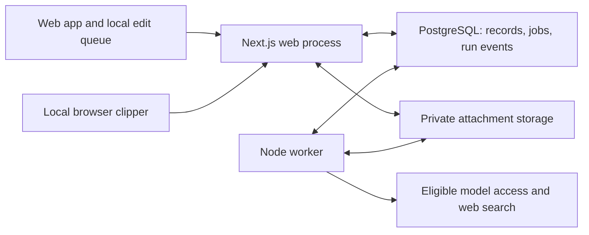

# Starlog — canonical product plan

Updated: 2026-10-03
Status: product scope and architecture preferences accepted; concrete architecture proposal ready for review; implementation has not started.

## Authority and how to use this plan

This is the single source of truth for Starlog's product vision, scope, priorities, and agreed decisions. It consolidates the October 2026 discussion and supersedes all earlier product plans, assistant reset documents, UI concepts, and the MCP exploration brief.

Read this plan first. Read AGENTS.md for repository process and docs/CURRENT_STATE.md for implementation evidence. Neither is a second product plan. Update this file in place as product and architecture decisions are made; do not introduce another VISION, NEWPLAN, PRD, or competing roadmap. Implementation tickets and detailed technical references must point back here.

Previous material is preserved under docs/archive/2026-10-03-legacy/. It is historical evidence, not instructions. Do not load or search it during normal planning or development. Consult a specific archived file only when a concrete question requires history or the user requests it. Archive recovery instructions are in that directory's README.

The existing application is legacy. The next product is a fresh implementation; reuse a specific piece only after showing that it fits the new plan. Existing schemas, routes, prompts, infrastructure, UI, and migrations create no obligations. Start the new app with a fresh Library while preserving existing data. Legacy data migration is not a first-release requirement; selective imports can follow actual need. The proposed fresh source layout is in section 7.

## 1. Vision

Starlog helps people build a daily practice of curiosity, clear thinking, and reflection. It brings worthwhile material into view, gives unfinished thoughts a place to develop, and offers questions and feedback that help users form their own understanding. Over time, it connects that understanding to memory, writing, projects, and choices while keeping the user in charge of what deserves their attention.

The first user is the owner of this project. The longer-term ambition is a product other people can use for their own learning journeys. Generalization should follow successful personal use.

The immediate problem is adoption. The user already takes notes, asks questions, and receives scheduled briefs in ChatGPT, but lacks the structure and continuity to repeat those activities reliably. Journaling also has the friction of starting the activity itself. Prioritize continuity and recurring practice, then retrieval and organization, then making development visible.

Notes and questions are the first usable loop. A narrow release is acceptable before the newspaper and journal are ready. Those can be developed in parallel once shared architecture and interfaces are agreed. More infrastructure, evaluation machinery, or speculative features must not become prerequisites for trying the core loop.

## 2. Product principles

- Preserve human intellectual participation. Formulating a question, attempting an explanation, and making a connection can themselves be the learning.

- Make unfinished thinking welcome. A fragment or unresolved question is a useful outcome.

- Offer appropriate help. Ask a useful question, explain a missing prerequisite, or answer directly according to the user's intent. Do not force every interaction through Socratic questioning.

- Distinguish access, attention, and understanding. Saving a source is not reading it; reading it is not mastering it.

- Keep commitments explicit. Captures, model suggestions, and temporary exercises do not automatically become review obligations.

- Make ordinary writing, reading, search, and journaling usable without model availability.

- Keep sessions bounded and easy to resume. Missing days should not create an intimidating backlog.

- Make model contributions inspectable. Preserve sources, distinguish suggestions from accepted content, and retain meaningful edit history.

- Optimize for useful thinking and sustained practice, not time spent, output volume, graph size, or completion streaks.

- Improve from actual use. Treat model-quality and engagement claims as hypotheses until real interactions support them.

## 3. First daily-use iteration

### Surfaces

| Surface | Purpose |
| --- | --- |
| Today | Resume current thinking; add the daily newspaper and evening journal as they become usable |
| Notebook | Notes, ongoing Threads, contextual discussions, search, links, and drafts |
| Reading | Raw clips and references in the Library, a deliberate Queue, and a small Up next selection |

Names and layout can be refined in design. These responsibilities describe the first daily-use iteration; the narrow notes/questions pilot does not wait for every surface to be complete. Detailed screen layouts, controls, and phone navigation have not been approved. Review a disposable interaction sketch of the core loop before implementing the product UI; the sketch is a design proposal, not a new visual specification or implementation authorization.

Desktop should give the note or source the main space and allow discussion alongside it. Phone browsers should offer the same core workflow in a suitable compact layout. Writing must be easy to reach. A universal chat thread is not the organizing requirement.

Use Tiptap as the formatted editor with Markdown shortcuts. Store versioned structured documents as the working format, offer Markdown plus attachments for portable export, and retain the original structured documents in complete backups. Rendering equations, code blocks, and tables is required, including material pasted or brought in through clips. How extraction and paste preserve the underlying math and document structure still needs validation; faithful display does not automatically imply lossless recovery of editable source. Markdown export may simplify complex formatting and is not the complete backup format.

### Notes, Threads, and questions

Create or edit a note without choosing a project, taxonomy, or learning technique. Begin with a real question, passage, thought, or rough explanation from reading or work. Quick notes can stand alone.

A Thread holds an ongoing question or pursuit across notes, sources, and discussions. Topics work as tags, rather than a required folder hierarchy. On return, suggest one useful starting point from the Queue or an existing open Thread, explain why, and make alternatives or a new start easy to choose.

Provide lightweight ways to express intent:

- Ask a question: help with something the user wants answered.

- Think this through: support investigation and reasoning; this is the default within an inquiry.

- Challenge my explanation: examine gaps, claims, assumptions, and counterexamples.

Both user-led and model-led questioning belong. Preserve the user's original question and allow a better question, revised explanation, or unresolved disagreement to become the saved outcome. Straightforward factual help remains available.

Web search is required for discussions, especially deeper investigations that benefit from outside evidence. Preserve source attribution alongside model responses and distinguish external material from the user's own thinking. This does not change the RSS-only scope of the daily newspaper. The supported model/tool route still needs validation.

Save discussions automatically. Offer an optional, editable checkpoint containing current thinking, unresolved questions, and a possible next step. Leaving must not require a wrap-up. Distinguish model-authored checkpoints from the user's own words; saving useful outcomes must not require promoting an entire conversation into a note.

The tutoring behavior should make the smallest useful intervention that leaves meaningful reasoning to the learner:

- Ask one coherent question at a time.

- Respond to the actual attempt and infer difficulty cautiously.

- Avoid hiding the key insight in the question, setup, or example.

- Avoid questions so vague that they prevent progress.

- Explain missing prerequisites rather than withholding needed knowledge.

- Make hints, direct explanation, and stopping available.

- Do not treat repeating a supplied hint as independent understanding.

### Lightweight review

Include an optional Revisit this action on an existing note or Thread in the first pilot. The user attempts an explanation, comparison, or application before revealing the earlier note or answer, then compares it with source-grounded feedback. They can revise their explanation, reopen the question, or finish. Reuse the contextual discussion workflow and distinguish later unaided attempts from guided in-session responses.

A revisit may occasionally be the suggested starting point on Today. It does not create a deck, grade, formal schedule, or accumulating obligation. Saving material does not automatically create a review commitment.

Formal spaced repetition remains a later option for explicitly chosen retention targets. Its introduction should follow a demonstrated wish to retain selected material, rather than an arbitrary library-size threshold. Participatory links belong early; a global graph remains deferred until it answers a concrete navigation or synthesis need.

### Inspectable knowledge context

Maintain provisional, correctable interpretations of the user's knowledge from notes and discussions, with links to their supporting evidence. Keep source records distinct from model inferences. Corrections take precedence over inferred interpretations, and rejected interpretations must not silently reappear. Copied text, model-authored explanations, and successful responses after hints do not establish independent understanding.

This context belongs to Starlog and must remain useful without access to ChatGPT memories. Research into existing memory systems may inform the implementation; no memory library, graph database, or extraction pipeline has been selected. Journal entries and their derived interpretations are excluded from this knowledge context.

### Daily newspaper

Provide a finite daily edition from selected RSS sources, focused initially on the user's current research and product interests. Expand that scope deliberately over time. YouTube, Google, and X remain separate services the user continues to use; importing or reconstructing their feeds is outside this initial scope.

The target is roughly ten minutes, with natural day-to-day variation rather than a hard limit. No fixed item count or section quota is agreed. Each item should have a concrete reason to read it, an explanation that develops the idea, source access, and an optional way to investigate further. The user may read and leave without creating a note, answering a quiz, or accepting a commitment.

Starlog should control its own recommendations and give the user control over sources, interests, and relevance. The eventual selection process can use broad heuristic filtering followed by more intelligent curation. Exact controls, ranking methods, and infrastructure remain architecture and iteration decisions.

Evaluate source relevance separately from writing quality. The newspaper should be compelling without sensationalism, manufactured certainty, or an endless stream. Preserve meaningful dates and attribution when summarizing outside material. A supplied-source trial is acceptable before an extensive autonomous research system exists.

Inspection of existing personal briefs found useful explanations, caveats, and personalization, but weak prioritization and repeated strong recommendations. Improve selection and differentiation through real feedback; reading every item must not become an obligation. Exact RSS sources and edition timing remain open.

### Nightly journal

Offer a short entry with editable questions. Possible defaults:

- What held my attention today?

- What changed my mind, or remained confusing?

- What would I like to return to tomorrow?

Users can replace these with questions about work, relationships, habits, or other concerns. A one-sentence entry is valid. Saving must not require inference. Offer model follow-ups as an optional action after writing; do not turn every entry into an extended interview.

Journal entries may inform journal recommendations only. Neither entries nor interpretations derived from them may influence knowledge context, tutoring, learning recommendations, or the newspaper. Preserve this boundary when designing retrieval and personalization.

Use one evening reminder with an easy skip/resume path. Exact time and questions remain configurable. Notification availability and delivery behavior must be verified in the selected web environment; this decision does not mean a reminder has already been scheduled.

### Clips, Library, Queue, and Up next

Adopt Obsidian-style browser clipping: preserve useful selected or extracted content and its source attribution. Storing text, HTML, and images is acceptable; link to videos. Reading and watching normally happen at the original source. Use local extension capture in Firefox on Android and supported desktop browsers, sending the resulting clip to Starlog for storage. URL/text sharing remains the fallback for other apps and browsers. Exact extension packaging, authentication, extraction fidelity, and attachment handling remain implementation choices to validate. Remote browser capture is deferred unless actual use demonstrates a need.

Raw clippings are retained source material. Notes can reference one or several clips when useful. Keep authored thinking distinct from quotations. There is no required processed state and no automatic promotion from a clip to a note.

Separate retained material from intended attention:

- Library: the larger searchable collection of clips, notes, and references.

- Queue: things the user intends to read, watch, or think about, not every saved reference.

- Up next: a small deliberate selection within the Queue, without a fixed three-item cap.

Read/unread status may help describe source attention independently of Queue membership. A rough fragment, open question, explanation, or assembled draft describes thinking; none requires a compulsory processing pipeline. No model should mark a source understood because it was opened, summarized, or discussed.

Offer a brief weekly pruning review of a handful of older Queue items, with suggestions and reasons. The user decides what stays in the Queue. Removing an item from the Queue leaves it available as reference; do not silently delete captures or create overdue work from everything saved.

### Connections and drafts

Start with explicit links and backlinks. Let the user describe a connection in their own words; optional relationship labels can help.

The model may suggest a connection with a reason and supporting passages. Suggested links remain distinct from user-authored or accepted links. Users can accept, reject, or ignore them.

Let users gather and arrange fragments into drafts. The model can critique an outline, identify a gap, ask what claim connects the fragments, or propose a structure when asked. Compare these approaches through use rather than assuming model-generated synthesis is always desirable.

A large interactive graph is a later experiment. It must help navigate or develop an idea to justify its complexity.

### Feedback built into use

Embed the brief and tutoring skills in their relevant interactions. The user should not have to copy prompts, invoke a skill manually, or manage model context to use the app.

Offer quick, optional feedback attached to the exact output:

- Brief: interesting, lost me, too obvious, poor explanation, or a comment.

- Questioning: too leading, too vague, need an explanation, or a comment.

Preserve the relevant interaction, source context, model/settings when available, and skill version. Keep feedback collection selective and reviewable. Revise skills from recurring failures and occasional comparisons, without making the user a full-time evaluator.

The September 2026 pilot produced draft Compelling Briefs and Socratic Learning skills. Its findings were mixed; they are starting hypotheses, not proven improvements. Preserve useful evaluation lessons: factual fidelity, source selection versus prose quality, who supplied an inference, prerequisite teaching, and later unassisted performance.

## 4. First-release acceptance

The narrow personal pilot must support a complete notes/questions loop:

1. Open on a laptop or Android browser and write a fragment or capture a source with minimal setup.
2. Ask a question or examine an explanation in context, with direct help available.
3. Keep the discussion, optionally save an editable checkpoint, and connect a note if useful.
4. Find prior work through search and resume an open Thread or something from Up next without reconstructing context.
5. Optionally revisit a note or Thread, attempt an explanation or application before revealing the prior answer, and compare or revise it.
6. Return after missed days without an intimidating backlog.
7. Flag an unhelpful question or review directly where it occurred.

The newspaper and journal complete the broader daily-use iteration as they become ready: read a finite RSS edition and leave feedback; write with chosen journal questions, optionally request a follow-up, and receive one evening reminder where delivery is supported. These features may progress in parallel once shared architecture is settled. They are not prerequisites for starting the narrow pilot.

Reliability requirements:

- Persistent private data and a recoverable save path.

- Account isolation verified with two test accounts from the first usable slice, even while real access is limited to the owner. Cover direct reads/writes, search and model-context retrieval, jobs and answer streams, attachments, exports, and cancellation.

- Clear distinction between saved locally and synced.

- Safe retry behavior; conflicting stale edits preserve both versions for user resolution instead of silently overwriting newer work.

- Useful access to already-loaded notes during brief connection interruptions, if included in the selected first implementation.

- Search, source links, and a practical export/backup path.

- Notes and journal remain usable when model access is unavailable or limits are reached.

- Model failures preserve partial output with an incomplete state and explicit Retry/Continue; automatic transient retries are bounded. Queued user requests take priority over background model work, with visible delays and no backlog of missed newspaper editions.

- No repeated CLI, prompt-copying, or skill-management chores in daily use.

Judge the pilot by whether the user returns, develops worthwhile questions or explanations, finishes a useful small session, and identifies actionable friction. Do not substitute completion counts or model-graded mastery for this evidence. Exact trial duration and cadence are open.

## 5. Fuller product vision

The mature product deepens the same practice rather than accumulating every Life OS feature.

### Starting a learning journey

A new user can begin with one curiosity, source, or real problem. Offer immediate useful work before requesting extensive setup. Establish interests, difficulty, reading appetite, and reflection preferences gradually.

Support informal exploration alongside deliberate goals. A curriculum must not be a prerequisite for notes, reading, or reflection.

### Continuing inquiry

A question can connect sources, notes, discussions, experiments, applications, and drafts. Show how the user's explanation changed, what evidence informed it, and which uncertainties remain.

### User-chosen learning commitments

Users can decide that something should be retained or practised. Support recall, teach-back, comparison, misconception checks, application, interleaving, and project work when useful. These formal commitments remain part of the fuller vision. The first pilot includes optional lightweight review without requiring a persistent practice commitment.

Distinguish a learning target from any particular exercise. Fixed cards, regenerated questions, and ephemeral exercises can coexist where evidence justifies them. Important conceptual formulation remains participatory; automatic generation may help mechanical material.

If spaced repetition is introduced, scheduling is deterministic. The model supplies semantic feedback or evidence, not invented due dates. Users can edit, suspend, reject, and retire commitments.

### A meaningful map

Connect notes, questions, sources, and projects with intelligible relationships and provenance. Keep accepted relationships distinct from model suggestions. The map represents recorded thinking, not a claim of comprehensive knowledge or mastery.

### Reflection and small experiments

Weekly or monthly reflection may reveal recurring interests, obstacles, and patterns. Present grounded observations the user can correct. Help choose a small change, try it, and revisit the result. Keep journal-derived reflection within journaling and use knowledge records for learning reflection. Broader habits and planning enter only where this practice benefits.

### Personalization and ownership

Improve relevance and assistance using explicit preferences and observed interactions, within the journal/knowledge boundary. Let users inspect and correct what the app assumes, control which material is used, pause directions, and export their work.

Other users must have their own private data and preferences. This expansion means independent personal accounts; collaboration within shared accounts or documents is not required. Account isolation, onboarding, support, and commercial model access must be resolved before offering a public service; personal subscription access does not settle that architecture.

## 6. Boundaries and deferred scope

Agreed platform direction:

- Web-first for laptop and phone. A native Android app is not a first-release requirement.

- Voice interaction is out of scope. Optional short briefing read-aloud may be added if it proves useful.

- Online storage is acceptable. Sync is reliability work, not the product's central differentiator.

- Prefer low-cost use of the user's ChatGPT plan for eligible intelligence workflows, subject to actual supported access and testing.

- Application data and history belong to Starlog; provider memory is not the only copy.

- No automatic separately billed model fallback. Any paid provider path needs an explicit decision.

- Keep credentials out of browser clients.

Deferred:

- Native mobile parity, custom alarms, STT/TTS infrastructure, and voice-first flows.

- A universal persistent assistant thread and assistant-driven management of every surface.

- Extensive calendar synchronization, time blocking, task orchestration, and autonomous life management.

- A plugin platform, comprehensive Obsidian compatibility, or a general graph editor.

- Full offline library replication, collaborative real-time editing, and sophisticated automatic conflict merging.

- Broad import/migration work, capture integrations beyond the agreed browser-clipping workflow, and automatic deck generation.

- Automated import or amalgamation of X, YouTube, or Google recommendation feeds.

- Public registration and multi-user service operations before a useful personal pilot. Account ownership and isolation are required from the first implementation.

Deferred items are options, not a promised backlog. Exact offline alarms and closed-app audio should not be assumed available merely because the app is a PWA.

## 7. Architecture decisions and remaining work

### Confirmed decisions

Confirmed in the architecture discussion:

- Railway is the intended host. The app and intelligence should work independently of the user's personal computer. Credential arrangements and supported model access still need validation; choosing a host does not authorize a deployment.
- Use one TypeScript codebase with a Next.js/React web app and a separate Node background worker on Railway. Share application logic and PostgreSQL for private records, history, relationships, search, and persistent jobs. Use pg-boss for queued work and private object storage for images and attachments. This foundation supports requested answers continuing after page closure and scheduled work; exact scheduling, recovery, capacity, and object-storage configuration remain to be specified.
- Starlog owns the working notes. Start with a fresh Library and preserve existing data; selective imports can come later. Markdown and attachment export remain useful; live editing of the same notes in Obsidian or an external folder is not required.
- Context begins with the active Thread and its attached material, with automatic retrieval of relevant knowledge records elsewhere in the Library when useful. Keep context inspectable and allow exclusions or a restricted discussion. Preserve source/authorship distinctions and the strict journal boundary.
- Graph memory is a possible later enhancement to retrieval. This is separate from a visible global graph and does not select a graph database now.
- Keep three update mechanisms separate: saved note changes refresh relevant knowledge context; recurring outputs refresh on a schedule or user trigger; tutoring and briefing instructions are versioned and changed deliberately. Automatic self-improvement of skills is a distant possibility, not initial scope.
- Use Tiptap with Markdown shortcuts and versioned structured documents as the working format. Provide Markdown and attachment export plus complete backups retaining the original structured documents. Equations, code, and tables must render, including pasted or clipped material. Validate extraction, paste, rendering, and export fidelity on representative content; the clipping extraction library is not selected.
- Use MIT for new original Starlog code, with the personal instance and data remaining private. The user accepts commercial and proprietary reuse by others under that license. Preserve the applicable licenses and notices of dependencies, reused material, and outside contributions; this is not a repository-wide relicensing decision.
- Local extension clipping is the primary full-capture route for Firefox on Android and supported desktop browsers. The user is willing to open material in Firefox to clip it. Keep URL/text sharing as the fallback for other apps and browsers. Defer remote browser capture unless actual use demonstrates a need.
- Retry ordinary queued saves automatically. If a stale device edit conflicts with a newer note, preserve both versions and offer a choice or manual combination; do not silently overwrite the newer edit. Sophisticated simultaneous-edit merging is deferred.
- Finish and save an already requested model answer when the user switches apps or closes the page, so it is available on return. Leaving must not initiate extra follow-up work. An explicit Stop action cancels the active request.
- Retry brief transient model failures a limited number of times. After a persistent failure or exhausted allowance, preserve any partial answer, mark it incomplete, and offer Retry/Continue. Do not silently resume the discussion hours later. Explicitly stopped work must not be restarted by retry handling.
- Give queued user-initiated model requests priority over background newspaper generation and derived-context updates. Combine background updates where useful and apply a bounded scheduled-work budget, tuned from actual use. Saved note text must remain available to the next discussion immediately; batching derived interpretations must not present stale interpretations as current. Show delayed work when model access is unavailable and avoid accumulating missed newspaper editions as a backlog.
- Build independent account ownership into the first implementation while admitting only the owner initially. Private records, relationships, derived context, background jobs, attachments, model connections, and any cached results must retain account scope. Derive access from authenticated server context and check resource ownership for every operation; use PostgreSQL row-level security as an additional safeguard with restricted runtime credentials. Preserve the journal/knowledge separation inside each account. Test cross-account denial with two accounts from the first usable slice, including background work and reused connections/caches. Public registration and broader service operations remain deferred.
- Keep Starlog account/session management separate internally from permission to use a ChatGPT plan. A separate app login is acceptable; a single visible ChatGPT sign-in is also acceptable if supported for the deployment. No particular login provider is selected. Intelligence remains central to the product, while its temporary unavailability must not block access to saved work.
- Include web search in contextual discussions. Validate native search, citations, contextual follow-ups, and limit behavior with the actual account and selected model before depending on the integration.

### Evidence and unresolved integration constraints

Current integration evidence: OpenAI now documents [ChatGPT plan usage for open-source apps](https://developers.openai.com/siwc/quickstart) and a [self-hosted VM route](https://developers.openai.com/siwc/token-sharing-open-source/self-hosted-vms). This supersedes any assumption that Sign in with ChatGPT is categorically unavailable. Starlog's eligibility, fit with Railway, and actual account inference remain unverified. It offers a [constrained Responses API flow](https://developers.openai.com/siwc/token-sharing-open-source/preview-limitations); it does not establish feature parity with API-key access. No model runtime or authentication route is selected yet.

Sign-in evidence: OpenAI distinguishes identity, the application's own session, and permission to use plan allowance. Its [hosted website sign-in](https://developers.openai.com/siwc/website) currently requires selected-partner access and a registered callback. The [open-source registration flow](https://developers.openai.com/siwc/token-sharing-open-source/sign-in) supplies verified identity too, but documents a local loopback callback; it does not establish an unrestricted Railway website-login flow. Internal separation need not mean two visible logins. Choose the simplest eligible flow after validation. [Native web search](https://developers.openai.com/siwc/token-sharing-open-source/preview-limitations) is subject to model and account/workspace policy; text inference alone does not prove it works.

Foundation evidence: Railway documents a [Next.js web app with a separate worker and PostgreSQL](https://docs.railway.com/guides/fullstack-nextjs); its example's Redis queue is not a requirement for Starlog. [pg-boss](https://github.com/timgit/pg-boss) supplies persistent PostgreSQL-backed jobs. Tiptap recommends [JSON persistence](https://tiptap.dev/docs/editor/core-concepts/persistence), while its [Markdown support](https://tiptap.dev/docs/editor/markdown) has conversion limitations. These are architecture selections supported by documentation, not an implemented or tested stack.

Capture evidence: [Obsidian Web Clipper officially supports Firefox Mobile](https://obsidian.md/help/web-clipper). A Firefox Android extension can capture the locally loaded page and send the resulting clip to Starlog; rich Android clipping does not inherently require a remote browser. Obsidian's [clipper source](https://github.com/obsidianmd/obsidian-clipper) uses Defuddle for extraction and Markdown conversion and is MIT licensed, excluding its branding assets. An adapted Starlog save destination or a thin extension around the extractor would still need implementation and device testing.

[Railway also documents Playwright in Docker](https://docs.railway.com/guides/playwright), but remote browser capture is deferred. A later server-side capture would see what the server can access, not the phone's authenticated session. No browser capture route has been implemented or tested. Compare local extraction on representative equations, code, and tables before selecting the implementation.

Licensing distinction: [MIT](https://opensource.org/license/mit) is selected for the new original code. Future proprietary versions remain possible subject to included third-party and contribution rights; earlier MIT releases retain their permissions. See the [OSI FAQ](https://opensource.org/faq). No existing files or third-party materials have been relicensed by this documentation change.

### Concrete architecture proposal for review

The choices above are accepted. The layout, module interfaces, data relationships, and mechanics below are the proposed implementation of those choices, pending review and the focused validation checks below. This is a design, not evidence of running software. Keep this proposal in the canonical plan rather than creating another product document.

#### Source layout and runtime

Use a fresh `product/` workspace in this repository, with its own package manifests, lockfile, TypeScript configuration, tests, and build entrypoints. Keep the current root tooling and legacy application outside its imports. Root workspace globs currently cover `apps/*`, `packages/*`, and `tools/*`; `product/` is unused. Verify the package manager actually resolves the intended workspace root before installation. Point future CI and Railway build contexts at the new workspace deliberately; their configuration is not changed by this plan.

```text
product/
  apps/web/          Next.js UI, authenticated requests, live answer delivery
  apps/worker/       Durable jobs, model execution, schedules, notifications
  apps/clipper/      Firefox Android and supported desktop capture
  packages/core/    Application modules and shared domain contracts
  packages/storage/ PostgreSQL migrations, queries, private-object access
  behavior/         Versioned tutoring, review, briefing, and journal text/examples
```

These are code locations, not six deployed applications. Start with the accepted web process, worker process, PostgreSQL, and private object storage. The extension is a separately installed browser client. Keep model credentials in protected server/worker storage; the browser and extension use narrowly authorized Starlog sessions or tokens.



#### Application modules

Modules share one codebase and use explicit interfaces; they do not imply separate network services. Keep framework routes and job handlers thin. Centralize the complicated rules in the module that owns them.

| Module | Interface and owned rules |
| --- | --- |
| Accounts | Establish authenticated account scope, authorize a resource, and connect model access. Own admission, sessions, credential protection, refresh coordination, and connection state. A client-supplied account ID cannot establish access. |
| Library | Save a note revision, retain a clip/reference, attach material to a Thread, and change tags, links, Queue, or Up next. Own stale-edit checks, attribution, account-consistent relationships, and exportable content. |
| Context | Prepare a bounded source packet for a specific account and purpose; refresh interpretations and apply user corrections. Own evidence revisions, exclusions, journal separation, and review-stage restrictions. |
| Discussions | Start or continue a discussion, revisit an idea, save an optional checkpoint, and attach feedback. Own conversation order, author/assistance distinctions, and the relationship between messages and requested work. |
| Journal | Save entries and configured questions, request journal-only follow-ups, and schedule the chosen reminder. Own entry history and all derived journal context; expose no journal material to Library search or learning context. |
| Newspaper | Fetch selected RSS material, select candidates, produce a finite edition, and record preference/quality feedback. Own source attribution, duplicates, account preferences, and edition state. |
| Work | Enqueue, execute, observe, and cancel a requested run. Own durable state, model transport using Accounts-provided connection handles, priority, bounded retries, budget checks, and persisted output. |

Start with one supported model implementation behind Work, preferably the documented direct Responses route if eligible and validated. A Codex runtime is an alternative to evaluate only if it supplies a needed capability. Do not build a provider marketplace or assume unsupported Responses features. Long-running work belongs to Starlog's worker regardless of provider background-mode support.

#### Minimal records and relationships

All private records and relationships carry account ownership. These are domain relationships, not a final SQL schema; use ordinary relational tables and explicit foreign keys rather than a generic graph store.

| Record or concept | Proposed representation |
| --- | --- |
| Note | Stable identity, current structured document, and revisions with attribution. A note can stand alone or appear in several Threads without copying its content. |
| Raw clip / reference | Source URL and capture metadata, retained extracted content when available, and attachment references. Preserve source material separately from authored notes; render retained HTML safely. A reference may remain only a link. |
| Thread | An ongoing question/pursuit plus links to notes, sources, discussions, and checkpoints. Membership does not imply understanding, Queue membership, or ownership transfer. |
| Discussion / message | An ordered conversation with an optional Thread and explicit material attachments. Messages preserve author, cited sources, assistance context when known, and associated run. Quick questions need not create a Thread first. |
| Checkpoint | An optional, editable account of current thinking, open questions, and a possible next step, retaining model/user provenance. Saving a discussion does not require accepting a checkpoint. |
| Connection | A link with an optional user explanation or label. Model suggestions retain reasons and supporting passages plus suggested/accepted/rejected state; they do not overwrite authored thinking or become commitments automatically. |
| Library / Queue / Up next | Library is the view of retained notes, clips, and references. Queue is explicit membership; Up next adds selection/order within it. Read status is independent. Removing Queue membership preserves the record. |
| Knowledge interpretation | A provisional claim with exact evidence revisions/passages, extraction version, and validity state. Corrections/rejections persist independently of re-extraction. There is no automatic mastery score. |
| Journal entry / interpretation | Journal-owned records and revisions, including journal-only model exchanges. Enforce their purpose in storage/query paths and background work, even if infrastructure is shared. |
| RSS item / edition | Source metadata and candidate material; an edition stores its selected items, explanations, dates, and feedback. Reading an edition does not silently create Library or Queue records. |
| Run | Request identity, account and purpose, source packet, behavior version, model/settings when available, attempts, output/citations, and terminal status. |
| Feedback | A response to an exact output, including its run and behavior version, with optional explanation. It does not point only to a mutable current note. |

#### Core data flows

**Save and sync.** Use IndexedDB to commit the local draft and persistent edit outbox together, with a stable mutation ID and base revision, then send the mutation to the server. Local-save status requires that transaction to succeed; synced status requires server acknowledgement. Handle quota/storage errors visibly and request persistent storage where supported, while recognizing that cleared browser data cannot be recovered from the outbox alone. The server authorizes ownership, deduplicates retries, and either commits a new revision or preserves the conflicting versions for resolution. Flush after edits and on reconnect/app opening; connectivity events are retry hints, not proof the server is reachable. Do not depend on Background Sync or the browser running continuously. This covers pending edits and loaded material, not full offline Library replication.

**Prepare context.** Load current attached material and the active Thread first, then bounded account-scoped PostgreSQL full-text results and explicit links. Apply access, purpose, exclusions, and durable corrections before supplying passages to the model. Keep exact source revisions in the packet so an answer remains attributable after later edits. Current note text is available immediately; invalidate affected interpretations synchronously and coalesce expensive re-extraction in the worker. Reject stale extraction results when their source revisions have changed. Add semantic/vector or graph retrieval only when concrete retrieval failures justify it; plan access does not establish an embeddings endpoint.

**Ask and return.** Flush pending edits to attached notes before submitting a question. If saving fails or conflicts, keep the question as a draft and expose the problem instead of answering from an unnoticed older revision. Persist the user's message and run, and enqueue work atomically. The worker builds the source packet, executes the versioned behavior through the selected model route, and persists ordered output events and citations. The web process delivers those events and can replay persisted progress on return. Closing a tab leaves the requested run active. Serialize turns within a discussion, or require an explicit separate discussion, so two simultaneous requests cannot silently corrupt its order.

**Recover and stop.** Use stable run/attempt identities and explicit queued, running, completed, interrupted, failed, or cancelled states. Persist partial output, classify retryable failures, and honor the agreed retry/budget rules. An explicit Stop prevents further work and propagates cancellation to the active model connection. Durable queues cannot guarantee exactly-once external inference: a worker may die after the provider accepted a request. Treat uncertain completion as interrupted rather than blindly issuing duplicate paid/allowance-consuming work. Retry/Continue creates a traceable attempt and never presents the old partial output as a completed answer.

**Review and learn.** During an unaided revisit, show the question/cue and collect the attempt before revealing the prior answer; exclude answer-bearing reference material from any model-generated cue at that stage. Feedback can then use the earlier note and sources. Preserve whether a response was independent, quoted, model-supplied, or assisted when known, and use conservative interpretations when it is not known. Test rejected claims returning in a new paraphrase as well as exact duplicates.

**Capture and scheduled work.** Propose a thin extension using [Defuddle](https://github.com/kepano/defuddle) on the currently loaded page with `useAsync: false` to disable optional external extraction fallbacks. Send source metadata, extracted content, and best-effort attachments to an authenticated Starlog capture endpoint. Preserve image links and report unavailable assets rather than promising every protected image can be copied. Treat clips and web results as source data, not behavior instructions. RSS ingestion performs inexpensive fetching/deduplication before bounded model curation; save one finite edition and coalesce missed schedules instead of replaying every missed day. Use server-scheduled Web Push for the evening reminder on user-selected subscribed devices where supported, with deduplication and expiry of stale reminders; delivery remains subject to browser permission and OS behavior. Exact alarms and closed-page audio remain outside scope.

#### Isolation, behavior versions, and recovery

Use account-scoped application queries plus PostgreSQL row-level security on private tables. Runtime roles must not own those tables or bypass the policies; migration credentials stay separate. Scope pooled connections within a transaction, authorize run streams and Stop actions, and check attachment ownership before issuing temporary access URLs. Keep journal-only data out of learning search indexes and context queries; account isolation alone does not enforce this additional purpose restriction.

Store behavior instructions and a small set of representative evaluation examples in `product/behavior/`. Pin each run to an immutable version and retain its source packet, with user-visible provenance. Reuse lessons from the earlier skills only after inspecting those specific packages; do not load the legacy runtime prompt collection. Exercise the accepted failure modes: leading questions, unsupported inferences, source fidelity, stale/rejected context, answer leakage, and journal leakage. Improve from real feedback; no automatic skill self-modification.

Full recovery must cover PostgreSQL records, structured note revisions, behavior versions, and the referenced attachment objects. Use stable immutable object keys for retained revisions and a manifest linking records to objects; Markdown export is a separate portability feature. Choose backup retention, credentials, and storage configuration during setup, and prove a restore into an empty instance before relying on the pilot for unique work. Portable content exports exclude provider secrets; protect backup credentials separately and allow model reconnection after recovery. Preserve all existing legacy data during the reset.

#### Validation and delivery order

| Step | Evidence required and consequence |
| --- | --- |
| 1. Model-access feasibility | Establish deployment eligibility separately from OAuth success. Then test the actual account/model for ordinary discussion, native web search with citations, a contextual follow-up, credential refresh/restart, and scheduled worker execution. If no eligible route fits, revisit hosting/model access with the user; do not silently substitute a billed provider. Hosting changes remain approval-gated. |
| 2. Capture/editor feasibility | On Firefox Android and a supported desktop browser, capture representative prose, equations, code, tables, selections, and images; paste/render/edit in Tiptap, export Markdown, and restore structured content. Document losses and unavailable assets. Select extension packaging from these results. |
| 3. Shared foundation | Establish the isolated workspace, migrations, account scope, outbox, run lifecycle, storage, and behavior-version contracts. Prove two-account denial, stale-edit recovery, stale-job rejection, and complete database-plus-object restoration. Test under the actual restricted runtime roles. |
| 4. First usable loop | Deliver note/capture → contextual question → saved discussion/checkpoint → search/resume → optional revisit. Verify browser closure, reconnect, worker interruption, Stop, partial answers, and limit handling on the real route; use desktop and phone UX evidence. Begin personal use and collect exact-output feedback. |
| 5. Broader daily iteration | Build RSS editions and the isolated journal/reminder against the shared contracts. They may proceed in parallel once the foundation is stable and parallel work is requested. Validate missed schedules, workload priority, finite budgets, and actual notification delivery. They do not gate the narrow pilot. |

Supporting references: [PostgreSQL row security](https://www.postgresql.org/docs/current/ddl-rowsecurity.html), [IndexedDB](https://developer.mozilla.org/en-US/docs/Web/API/IndexedDB_API), [browser storage limits](https://developer.mozilla.org/en-US/docs/Web/API/Storage_API/Storage_quotas_and_eviction_criteria), [Background Sync limitations](https://developer.mozilla.org/en-US/docs/Web/API/Background_Synchronization_API), and [Web Push](https://developer.mozilla.org/en-US/docs/Web/API/Push_API). These describe mechanisms; they do not establish Starlog or device success.

The user has authorized delegated feasibility checks. Current results and limits belong in docs/CURRENT_STATE.md; local library or public-endpoint checks do not establish browser, account, or hosted success. The remaining sequence is proposed, not permission to implement or deploy. Before product implementation, review the consolidated architecture and concrete interface flow, then turn approved work into scoped workitems that point here and deliver a complete usable loop. Concrete evidence can revise a technical choice without reopening settled product scope by default.

## 8. Open preferences and decision record

The initial product scope is settled enough to proceed to architecture. Remaining configuration and interaction details can be chosen during design or real use; they do not require another product-scope round. Revisit an accepted scope decision only if concrete feasibility evidence or use reveals a need.

Still open:

- Detailed desktop and phone interaction design for writing, contextual discussion, resuming a Thread, and revisiting earlier thinking. The surface responsibilities are agreed; a conversation sketch is not an approved visual reference.

- Exact RSS sources, edition timing, and the first recommendation controls; focus and approximate reading time are agreed.

- Exact journal questions and evening reminder time; a single reminder and journal-only use of entries are agreed.

- The concrete interaction for the first connection suggestion and the need that would justify a larger graph.

- Pilot cadence and the threshold for expanding beyond personal use.

- Review of the concrete architecture proposal and validation results in section 7, including the supported sign-in/model route, source layout, and detailed module contracts. MIT and a fresh Library are agreed.

Accepted on 2026-10-03:

- Consolidate this conversation into one canonical plan; archive earlier plans so they do not drive future development.

- Prioritize notes/questions and continuity. Start with a narrow usable loop, allowing the newspaper and journal to progress in parallel after shared architecture is agreed.

- Organize ongoing inquiry as Threads, Topics as tags, and deliberate attention as Queue/Up next within a broader Library.

- Save discussions automatically and offer editable, optional checkpoints. Preserve the user's reasoning and distinguish model contributions.

- Use provisional knowledge interpretations with evidence and durable corrections; provider memories are not required.

- Adopt browser clipping with raw source material referenced by notes, without a required processed state; prune the deliberate Queue periodically with user decisions.

- Create a finite RSS newspaper for current interests, targeting roughly ten minutes without a hard cap. Keep YouTube, Google, and X separate; expand source scope deliberately and evolve curation through use.

- Provide customizable journaling, optional follow-ups, and one evening reminder. Journal entries and their derived context influence journal recommendations only.

- Include lightweight optional review in the first pilot: attempt before revealing the earlier answer, compare with feedback, and revise or reopen. No automatic deck or due backlog.

- Start with participatory links and distinguish model suggestions. Formal SRS for chosen retention targets and a global graph remain later options, driven by actual retention or navigation needs.

- Embed draft skills into real use and iterate from feedback.

- Keep web-first delivery and deliberate human interaction.

- Start with a fresh Library, preserve existing data, and use MIT for new original code.

- Discuss architecture before starting the fresh application.

## 9. Historical continuity and references

Retained from previous visions: lifelong learning, reflection, follow-through, provenance, inspectable history, user-chosen commitments, varied practice, and useful bounded recommendations.

Reframed: proactivity becomes a worthwhile brief, an optional connection or question, and a chosen reminder. Life OS is an aspiration to connect learning and living, not a mandate to manage every domain.

Superseded: voice/chat-first UX, native mobile parity, compulsory assistant-ui protocol migration, the old surface taxonomy, mandatory separate Python orchestration and fallback providers, and MCP/ChatGPT-hosted UI as a predetermined architecture.

For a specific historical question, use the [archive inventory](docs/archive/2026-10-03-legacy/README.md). It points to preserved originals; it is not a reading list.

Existing skill experiment:

- [Pilot findings](C:/Users/bossg/Documents/Codex/2026-09-24/s/outputs/skill-evaluation-pilot/report.md) — local personal artifact, not a portable product dependency.

- Local draft packages: C:/Users/bossg/Documents/Codex/2026-09-24/s/outputs/skills/compelling-briefs/ and socratic-learning/.

- Matt Pocock's [skills repository](https://github.com/mattpocock/skills) supplies development workflows for subsequent questioning and design. Installing these does not settle architecture or start implementation.

If a development skill normally produces another product document, incorporate the relevant decision into this PLAN.md instead. Technical detail and tickets may reference it without duplicating the vision.
