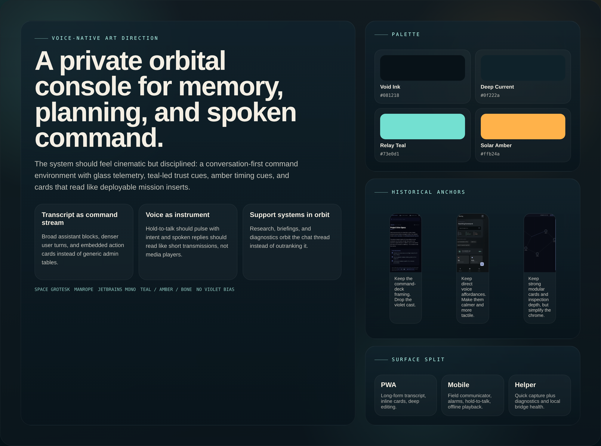
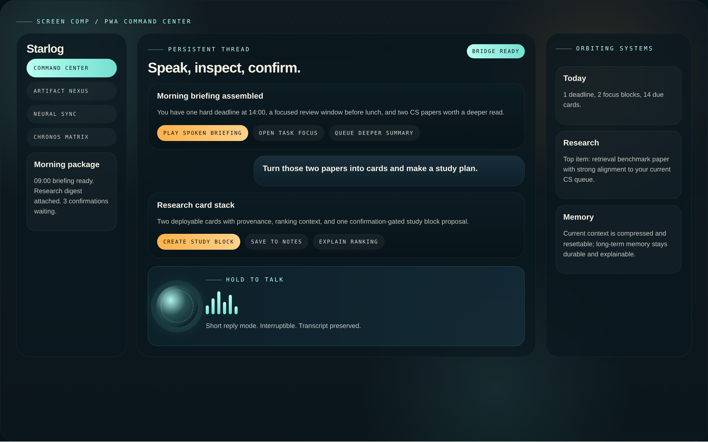
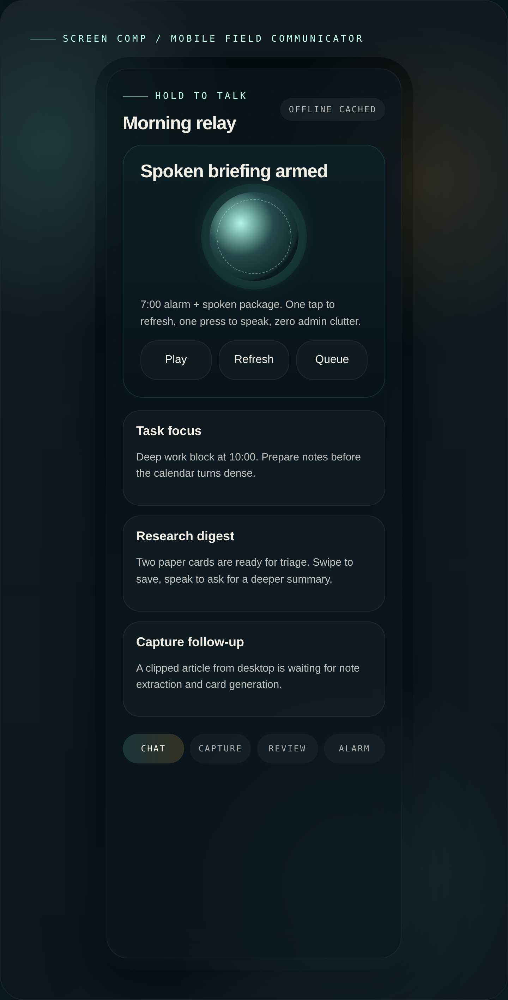
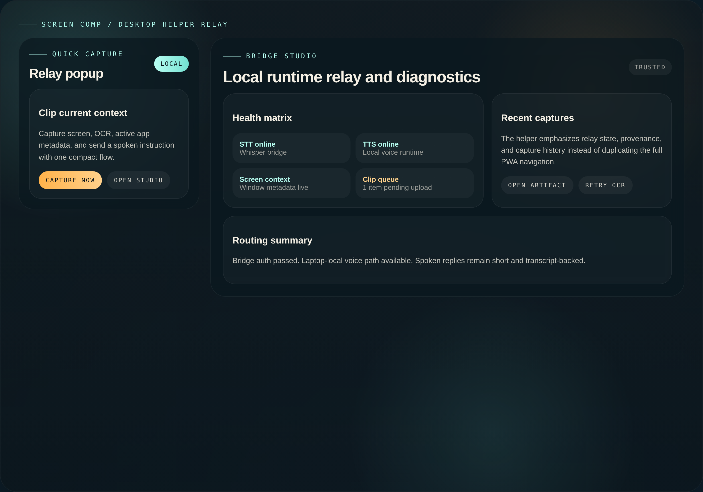

# Voice-Native Image Assets

This file documents the image-backed artifacts added for:

- `WI-573` Image-backed voice-native moodboard board
- `WI-574` Screen design comps for chat-first PWA, mobile, and helper

## Source of truth

These PNGs are derived from:

- `VOICE_NATIVE_MOODBOARD.md`
- `VOICE_NATIVE_TOKENS.md`
- `VOICE_NATIVE_SURFACE_SPEC.md`
- existing `screen_design/**/screen.png` references used only as historical anchors inside the moodboard board

## Generation method

The assets are generated locally from:

- `docs/design/voice_native_artboards.html`
- `docs/design/render_voice_native_assets.mjs`

The renderer uses local HTML/CSS artboards and Playwright element screenshots so the outputs are reproducible without requiring a hosted image-generation service.

## Exported files

- `assets/voice_native_moodboard_board.png`
- `assets/voice_native_pwa_chat_comp.png`
- `assets/voice_native_mobile_voice_comp.png`
- `assets/voice_native_desktop_helper_comp.png`

## Preview

### Moodboard board

### PWA command center comp

### Mobile hold-to-talk comp

### Desktop helper comp

## Notes

- The moodboard board intentionally shifts away from the earlier violet-heavy references toward the teal/amber palette defined in the markdown package.
- The three screen comps are not implementation mocks; they are design targets for future frontend polish.
